# Sơ Đồ Thiết Kế EduChain

## Tổng Quan Kiến Trúc Hệ Thống

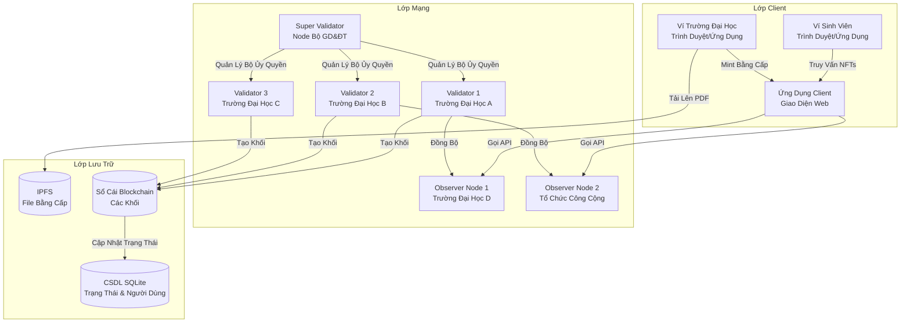

## Vai Trò Node và Tương Tác

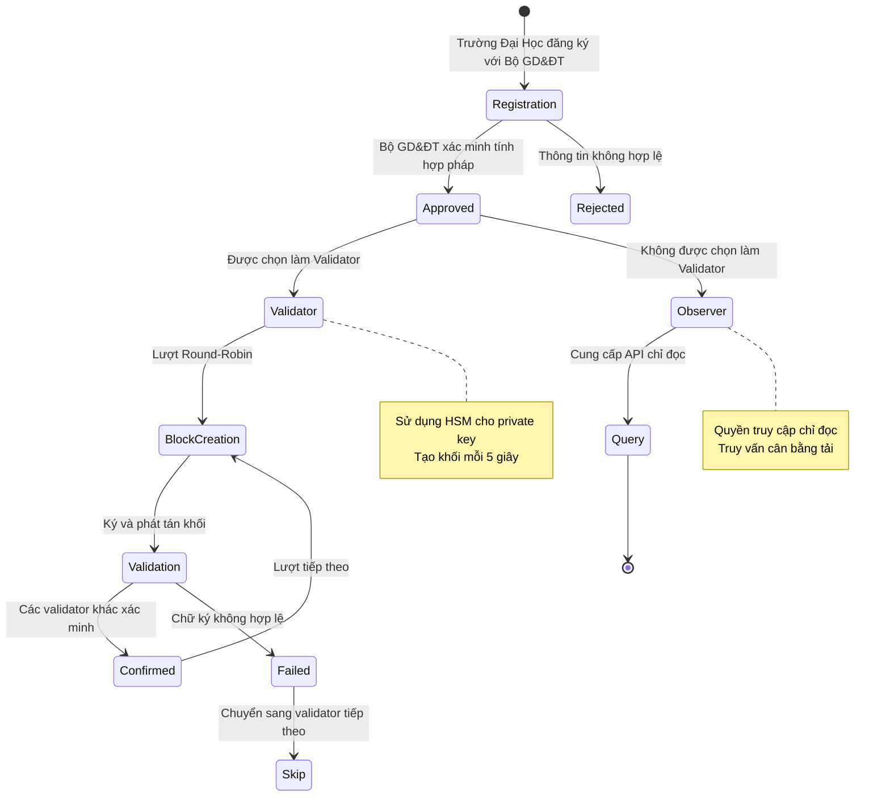

## Luồng Đồng Thuận PoA

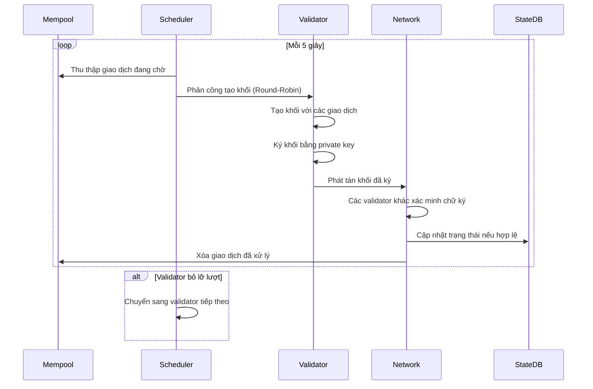

## Quy Trình Minting Bằng Cấp

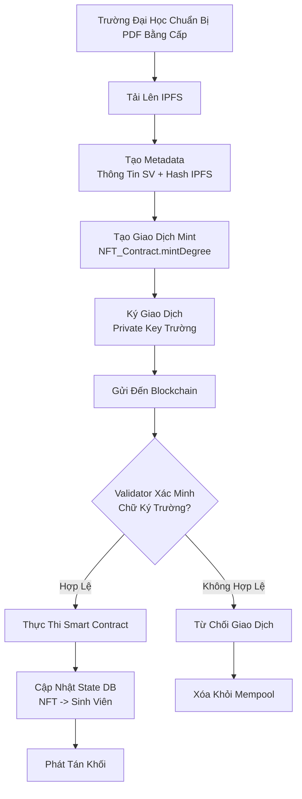

## Quy Trình Xác Minh Bằng Cấp

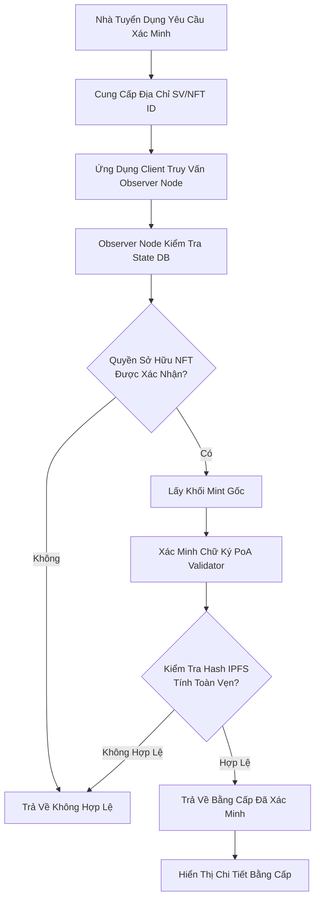

## Kiến Trúc Quản Lý Khóa

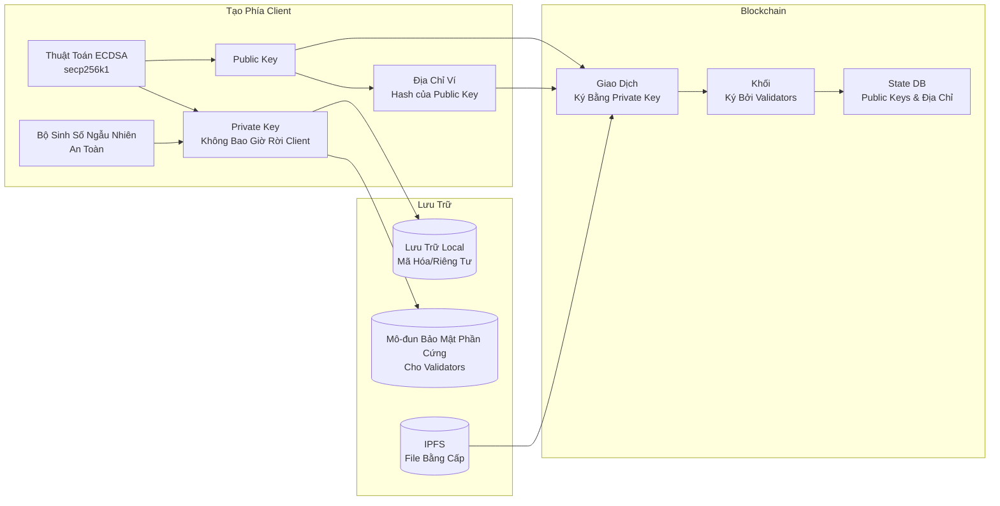

## Data Flow Architecture

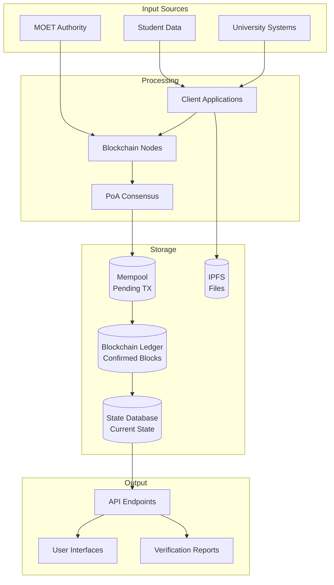

## Sơ Đồ Vai Trò và Phân Quyền

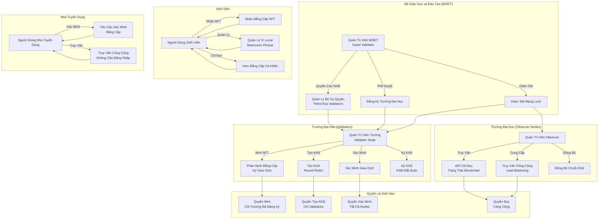

## Kiến Trúc Mạng Lưới

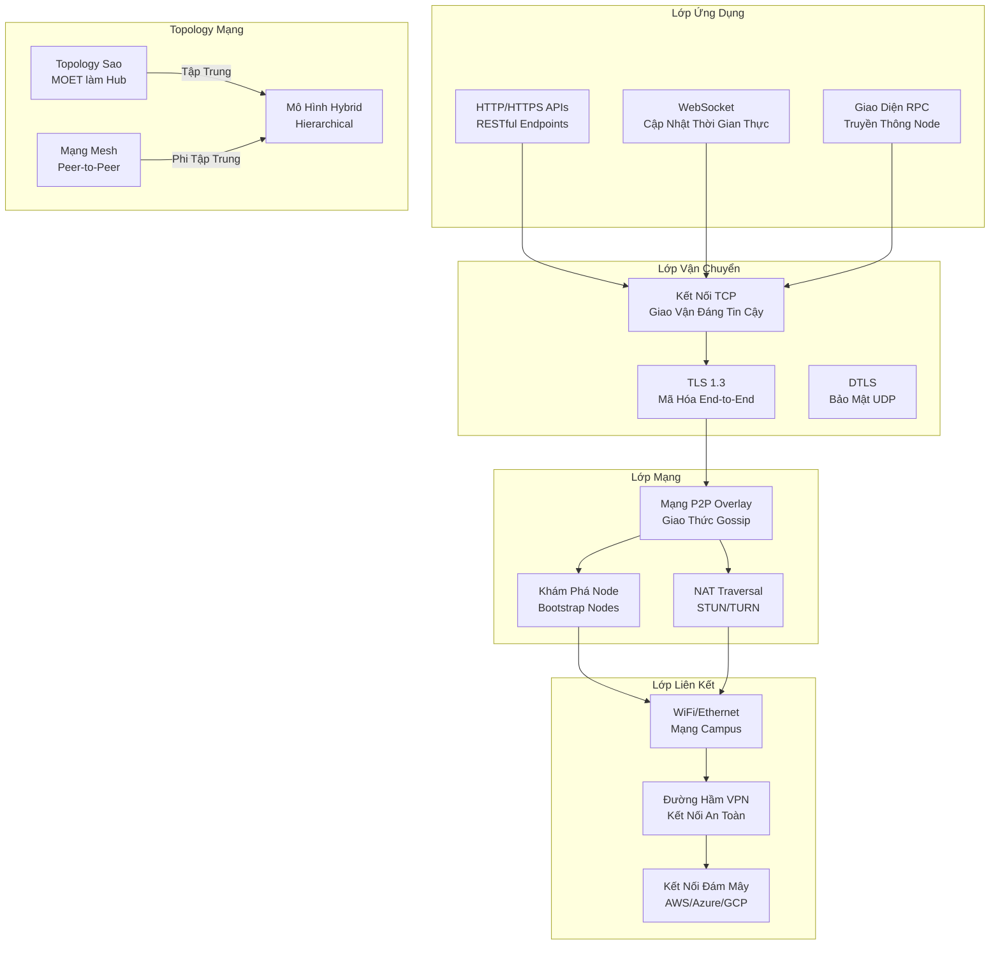

## Giao Thức Truyền Thông Giữa Các Nodes

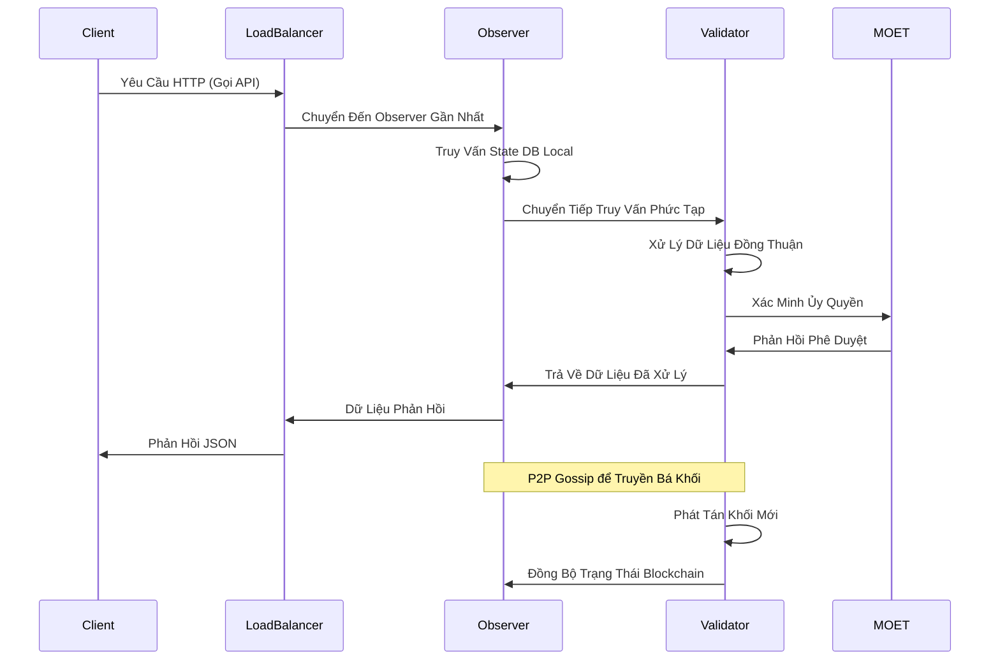

## Cấu Trúc Mạng P2P

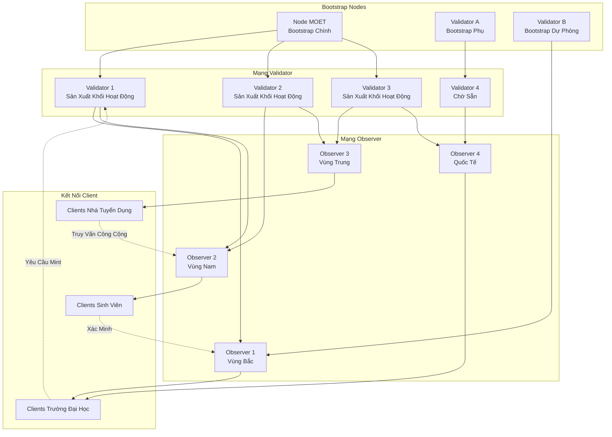

## Bảo Mật Mạng

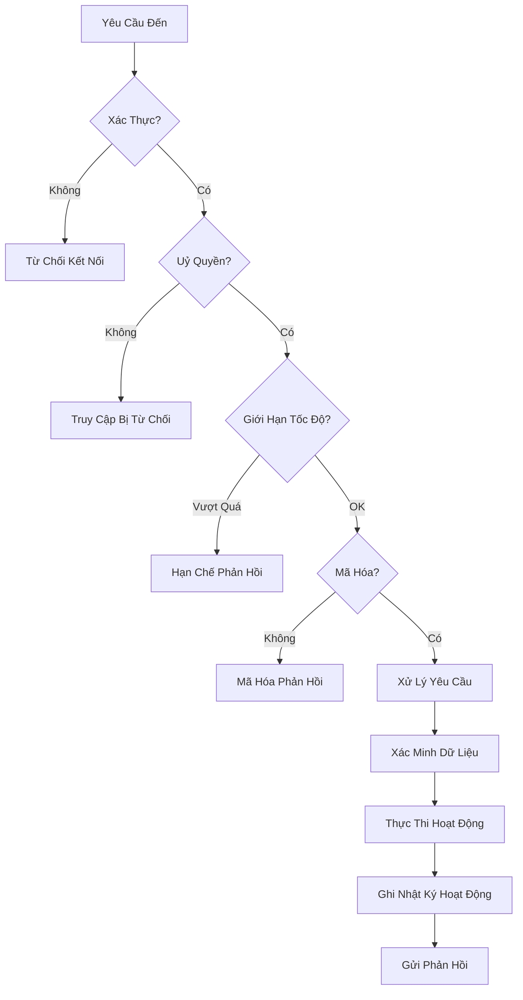

## Cân Bằng Tải và Dự Phòng

```mermaid
graph LR
    subgraph "Load Balancers"
        LB1[LB Chính<br/>AWS ELB]
        LB2[LB Phụ<br/>Azure LB]
        LB3[LB Dự Phòng<br/>GCP LB]
    end

    subgraph "Observer Clusters"
        OC1[Cluster Bắc<br/>3 Nodes]
        OC2[Cluster Nam<br/>3 Nodes]
        OC3[Cluster Trung<br/>3 Nodes]
    end

    subgraph "Validator Clusters"
        VC1[Validators Hoạt Động<br/>3 Nodes]
        VC2[Validators Chờ Sẵn<br/>2 Nodes]
    end

    subgraph "Hệ Thống Backup"
        BK1[Backup Ngoài Site<br/>AWS S3]
        BK2[Backup Local<br/>On-premise]
    end

    LB1 --> OC1
    LB1 --> OC2
    LB2 --> OC2
    LB2 --> OC3
    LB3 --> OC3
    LB3 --> OC1

    OC1 --> VC1
    OC2 --> VC1
    OC3 --> VC2

    VC1 --> BK1
    VC2 --> BK2